# UML Диаграмма классов

## Диаграмма классов игры "RPG Adventure"

```mermaid
classDiagram
    %% Основные игровые классы
    class Game {
        -Player player
        -Enemy enemy
        -Battle battle
        -World world
        -bool inBattle
        -bool questActive
        -bool questCompleted
        -bool secondQuestActive
        -bool secondQuestCompleted
        -bool gameFinished
        -vector~pair~string,int~~ shopGoods
        -int battleEnemyX
        -int battleEnemyY
        +Init()
        +Run()
        +Render()
        +Update()
        +Exit()
        -PrintHelp()
        -HandleCommand(string)
        -ShowShop()
        -BuyItem(string)
        -SellItem(string)
        -UseSkill(string)
        -CastSpell(string)
    }

    class Player {
        -int hp
        -int maxHp
        -int mana
        -int maxMana
        -int level
        -int attackPower
        -bool defending
        -int gold
        -vector~string~ inventory
        -string equipped
        -string equippedArmor
        -string equippedArtifact
        -int weaponUpgrades
        -int armorUpgrades
        -vector~Buff~ buffs
        +Attack(Enemy)
        +Defend()
        +UseItem(Item)
        +Move(int, int)
        +LevelUp()
        +TakeDamage(int)
        +Heal(int)
        +GetHP() int
        +IsDefending() bool
        +AddGold(int)
        +GetGold() int
        +AddItem(string)
        +GetInventory() vector~string~
        +Equip(string) bool
        +GetEquipped() string
        +HasItem(string) bool
        +RemoveItemByName(string) bool
        +GetLevel() int
        +GetMana() int
        +GetMaxHp() int
        +GetMaxMana() int
        +RestoreMana(int)
        +AddBuff(string, int, int)
        +RemoveBuff(string)
        +HasBuff(string) bool
        +GetBuffPower(string) int
        +UpgradeWeapon()
        +UpgradeArmor()
        +GetWeaponUpgrades() int
        +GetArmorUpgrades() int
        +EquipArmor(string)
        +GetEquippedArmor() string
        +GetArmorDefense() int
        +EquipArtifact(string)
        +GetEquippedArtifact() string
    }

    class Enemy {
        -int hp
        -int attackPower
        -bool defending
        -bool isMagical
        -bool hasBuff
        +Attack(Player)
        +Defend()
        +Think(Player)
        +TakeDamage(int)
        +DropLoot()
        +GetHP() int
        +IsDead() bool
        +HasBuff() bool
        +SetMagical(bool)
        +IsMagical() bool
        +Reset()
    }

    class Battle {
        -Player* player
        -Enemy* enemy
        -World* world
        -bool active
        +Start(Player, Enemy, World)
        +PlayerTurn()
        +EnemyTurn()
        +CheckWin() bool
        +End()
        +IsActive() bool
    }

    class World {
        -int width, height
        -int playerX, playerY
        -int enemyX, enemyY
        -bool enemyPresent
        -int npcX, npcY
        -int merchantX, merchantY
        -bool hasMerchant
        -int secondNPCX, secondNPCY
        -bool hasSecondNPC
        -int dragonX, dragonY
        -bool hasDragon
        -bool dragonDefeated
        -vector~vector~MapTile~~ grid
        -vector~pair~int,int~~ extraEnemies
        +Generate()
        +Draw()
        +Update()
        +GetTile(int, int) MapTile*
        +MovePlayer(int, int) bool
        +MoveEnemyTowardPlayer() bool
        +MoveEnemyRandom() bool
        +DistToEnemy() int
        +GetPlayerX() int
        +GetPlayerY() int
        +GetEnemyX() int
        +GetEnemyY() int
        +SetEnemyPos(int, int)
        +HasEnemy() bool
        +IsNearEnemy() bool
        +IsAtNPC() bool
        +IsAtMerchant() bool
        +IsNearNPC() bool
        +IsNearMerchant() bool
        +GetNPCX() int
        +GetNPCY() int
        +GetMerchantX() int
        +GetMerchantY() int
        +HasMerchant() bool
        +ActivateMerchantAtNPC()
        +SpawnSecondNPC()
        +IsNearSecondNPC() bool
        +SpawnDragon()
        +IsDragonDefeated() bool
        +HasDragon() bool
        +GetDragonX() int
        +GetDragonY() int
        +SetDragonDefeated(bool)
        +ClearDragon()
        +SpawnEnemyAt(int, int) bool
        +ClearMainEnemy()
        +SpawnEnemy() bool
        +SpawnExtraEnemy() bool
        +MoveExtraEnemies()
        +EngageAdjacentExtraEnemy(int, int) bool
    }

    %% Система предметов
    class Item {
        #string name
        #string description
        #int value
        +Item(string, string, int)
        +virtual ~Item()
        +virtual Use(Player)
        +virtual GetName() string
        +virtual GetDescription() string
        +virtual GetValue() int
        +virtual Item* Clone()
    }

    class Weapon {
        -int damage
        -int durability
        -int maxDurability
        +Weapon(string, string, int, int)
        +GetDamage() int
        +Upgrade()
        +Break()
        +Repair()
        +Use(Player)
        +Weapon* Clone()
        +GetDurability() int
        +GetMaxDurability() int
    }

    class Armor {
        -int defense
        -int durability
        -int maxDurability
        +Armor(string, string, int, int)
        +GetDefense() int
        +Upgrade()
        +Break()
        +Repair()
        +Use(Player)
        +Armor* Clone()
        +GetDurability() int
        +GetMaxDurability() int
    }

    class Potion {
        -string effect
        -int power
        -bool expired
        +Potion(string, string, int, string, int)
        +Drink(Player)
        +GetEffect() string
        +IsExpired() bool
        +Use(Player)
        +Potion* Clone()
    }

    %% NPC и квесты
    class NPC {
        -string name
        -string dialog
        -bool hasQuest
        -bool questCompleted
        +NPC(string, string)
        +Talk()
        +GiveQuest()
        +ReceiveItem(Item)
        +Reward(Player)
        +GetName() string
        +HasQuest() bool
        +CompleteQuest()
    }

    class Quest {
        -string description
        -int reward
        -bool started
        -bool completed
        +Quest(string, int)
        +Complete(Player)
        +GetDescription() string
        +GetReward() int
        +IsStarted() bool
        +IsCompleted() bool
    }

    %% Торговая система
    class Shop {
        -vector~Item*~ goods
        +~Shop()
        +Buy(Player, Item)
        +Sell(Player, Item)
        +ListGoods()
        +AddItem(Item)
        +RemoveItem(Item)
        +GetGoods() vector~Item*~
    }

    %% Вспомогательные классы
    class MapTile {
        -char type
        -bool walkable
        -bool occupied
        +SetType(char)
        +GetType() char
        +SetWalkable(bool)
        +IsWalkable() bool
        +SetOccupied(bool)
        +IsOccupied() bool
    }

    class Inventory {
        -vector~Item*~ items
        +AddItem(Item*)
        +RemoveItem(Item*)
        +GetItems() vector~Item*~
        +HasItem(string) bool
        +GetItemByName(string) Item*
    }

    class Logger {
        -vector~string~ logs
        +Log(string)
        +GetLogs() vector~string~
        +Clear()
    }

    class Menu {
        -vector~string~ options
        +AddOption(string)
        +Show() int
        +Clear()
    }

    class Dialog {
        -string text
        -vector~string~ responses
        +SetText(string)
        +AddResponse(string)
        +Show() int
        +Clear()
    }

    class Utils {
        +RandomInt(int, int) int
        +RandomFloat(float, float) float
        +Clamp(int, int, int) int
    }

    %% Система навыков и магии
    class Skill {
        -string name
        -string description
        -int cost
        -int cooldown
        +Skill(string, string, int)
        +GetCost() int
        +Upgrade()
        +GetDescription() string
        +Cooldown()
        +GetName() string
        +GetCooldown() int
    }

    class Magic {
        -int manaCost
        -int power
        +Magic(string, string, int, int)
        +Cast(Player, Enemy)
        +GetManaCost() int
        +Enchant(Item)
        +Upgrade()
        +Cooldown()
    }

    %% Связи между классами
    Game --> Player : contains
    Game --> Enemy : contains
    Game --> Battle : contains
    Game --> World : contains
    
    Battle --> Player : uses
    Battle --> Enemy : uses
    Battle --> World : uses
    
    Player --> Item : uses
    Player --> Inventory : contains
    
    World --> MapTile : contains
    
    Item <|-- Weapon : inherits
    Item <|-- Armor : inherits
    Item <|-- Potion : inherits
    
    Skill <|-- Magic : inherits
    
    Shop --> Item : manages
    NPC --> Item : receives
    NPC --> Quest : gives
    Quest --> Player : rewards
    
    Player --> Skill : uses
    Player --> Magic : casts
    Magic --> Item : enchants
    Magic --> Enemy : targets
```

## Описание основных связей

### Композиция
- `Game` содержит экземпляры `Player`, `Enemy`, `Battle`, `World`
- `Player` содержит `Inventory` и коллекции предметов
- `World` содержит двумерную сетку `MapTile`

### Наследование
- `Weapon`, `Armor`, `Potion` наследуются от `Item`
- `Magic` наследуется от `Skill`
- Используется полиморфизм для унифицированной работы с предметами и навыками

### Ассоциация
- `Battle` использует ссылки на `Player`, `Enemy`, `World`
- `Shop` управляет коллекцией `Item*`
- `NPC` может получать `Item` и давать `Quest`
- `Player` использует `Skill` и `Magic` для специальных способностей

### Зависимости
- `Player` зависит от `Item` для использования предметов
- `Player` зависит от `Skill` и `Magic` для использования способностей
- `Quest` зависит от `Player` для выдачи наград
- `NPC` зависит от `Item` и `Quest` для взаимодействия
- `Magic` зависит от `Item` для зачарования предметов
- `Magic` зависит от `Enemy` для атаки противников
