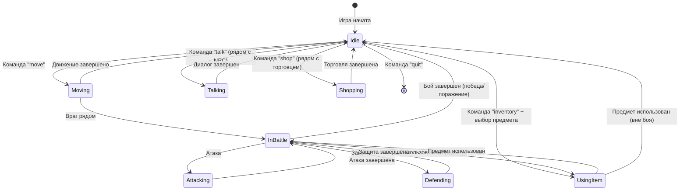
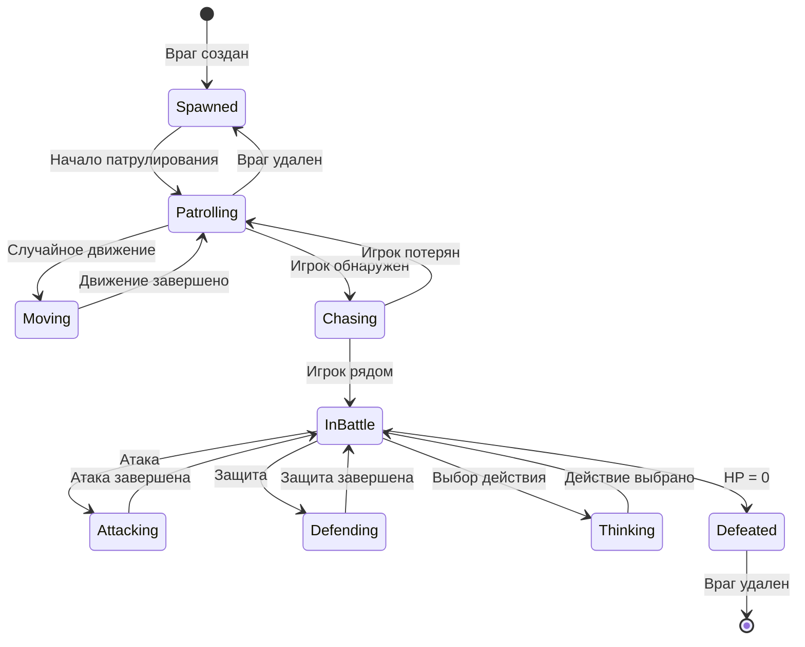
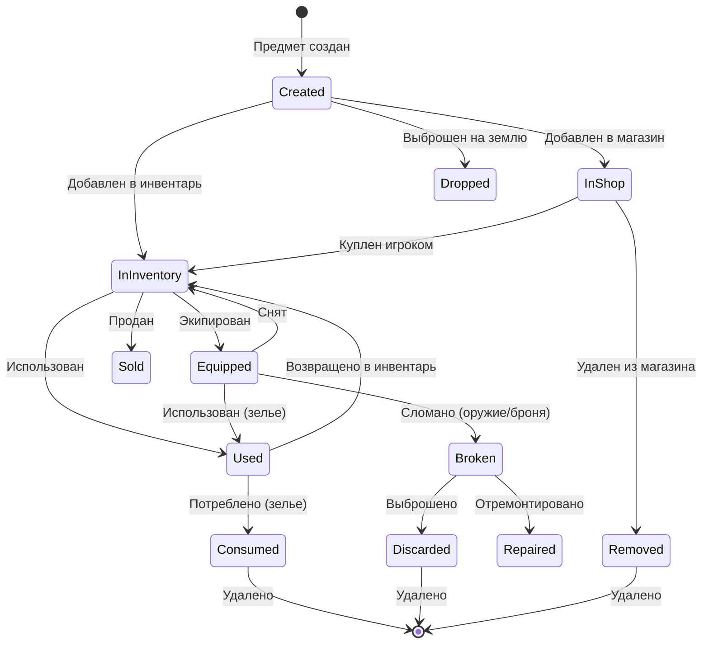

# UML Диаграмма игрового процесса

## Диаграмма последовательности игрового процесса

```mermaid
sequenceDiagram
    participant U as User
    participant G as Game
    participant P as Player
    participant W as World
    participant B as Battle
    participant E as Enemy
    participant N as NPC
    participant S as Shop

    Note over U,S: Инициализация игры
    U->>G: Запуск игры
    G->>G: Init()
    G->>P: Создание игрока
    G->>W: Generate() - создание мира
    G->>W: SpawnEnemy() - появление врагов
    G->>N: Размещение NPC

    Note over U,S: Основной игровой цикл
    loop Игровой цикл
        G->>G: Render() - отрисовка
        G->>U: Показать интерфейс
        U->>G: Ввод команды
        
        alt Команда "move"
            G->>W: MovePlayer(dx, dy)
            W->>W: Проверка границ и препятствий
            W-->>G: Результат движения
            G->>W: MoveExtraEnemies() - движение врагов
            
            alt Враг рядом с игроком
                W->>G: IsNearEnemy() = true
                G->>B: Start(Player, Enemy, World)
                B->>B: active = true
                Note over U,S: Боевая система
                loop Бой
                    B->>B: PlayerTurn()
                    B->>P: Показать варианты действий
                    U->>B: Выбор действия
                    
                    alt Атака
                        B->>P: Attack(Enemy)
                        P->>E: TakeDamage(damage)
                        E-->>P: Результат атаки
                    else Защита
                        B->>P: Defend()
                        P->>P: defending = true
                    else Использование предмета
                        B->>P: UseItem(item)
                        P->>P: Применение эффекта
                    end
                    
                    alt Враг жив
                        B->>B: EnemyTurn()
                        B->>E: Think(Player)
                        E->>P: Attack(Player)
                        P->>P: TakeDamage(damage)
                    end
                    
                    B->>B: CheckWin()
                end
                
                alt Игрок победил
                    B->>E: DropLoot()
                    E->>P: Добавить предметы/золото
                    B->>B: End()
                    B->>W: ClearMainEnemy()
                else Игрок проиграл
                    B->>B: End()
                    G->>G: Game Over
                end
            end
        end
        
        alt Команда "talk" (рядом с NPC)
            G->>W: IsNearNPC()
            W-->>G: true
            G->>N: Talk()
            N->>U: Показать диалог
            
            alt NPC дает квест
                N->>G: GiveQuest()
                G->>G: questActive = true
            end
        end
        
        alt Команда "shop" (рядом с торговцем)
            G->>W: IsNearMerchant()
            W-->>G: true
            G->>S: ListGoods()
            S->>U: Показать товары
            U->>G: Выбор товара
            G->>S: Buy(Player, Item)
            S->>P: Списывание золота
            S->>P: Добавление предмета
        end
        
        alt Команда "inventory"
            G->>P: GetInventory()
            P->>U: Показать предметы
            U->>G: Выбор предмета
            G->>P: UseItem(item)
            P->>P: Применение эффекта
        end
        
        alt Команда "help"
            G->>G: PrintHelp()
            G->>U: Показать справку
        end
        
        alt Команда "quit"
            G->>G: Exit()
            break
        end
        
        G->>G: Update() - обновление состояния
    end
```

## Диаграмма состояний игрока



## Диаграмма состояний врага



## Диаграмма состояний предметов



## Описание игрового процесса

### Основные состояния игры:
1. **Инициализация** - создание всех объектов, генерация мира
2. **Игровой цикл** - основной цикл обработки команд
3. **Бой** - пошаговая боевая система
4. **Взаимодействие** - диалоги с NPC, торговля
5. **Завершение** - выход из игры

### Ключевые механики:
- **Движение** - перемещение по карте с проверкой препятствий
- **Бой** - пошаговая система с выбором действий
- **Инвентарь** - управление предметами и их использование
- **Квесты** - получение и выполнение заданий
- **Торговля** - покупка и продажа предметов
- **Улучшения** - апгрейд оружия и брони
